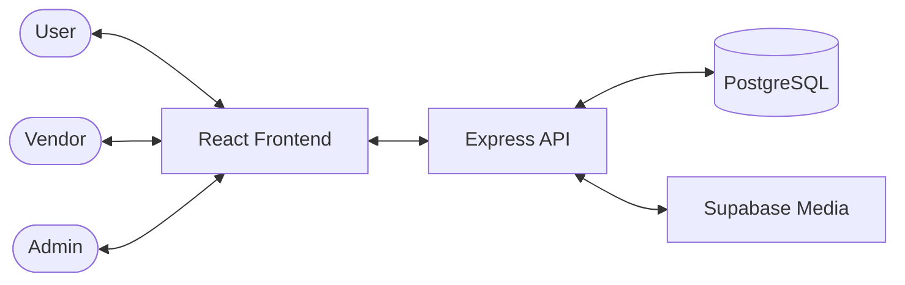

# StyleSwap: The Art of Luxury

StyleSwap is an elite, editorial-first luxury rental ecosystem. It facilitates the seamless acquisition and lending of high-end fashion, wedding attire, and jewelry through a secure, escrow-backed protocol.

## 🏛️ Ecosystem Architecture

## 🛠️ Technology Stack

- **Frontend**: React (Vite), Context API for state management, Lucide React icons.
- **Backend**: Node.js, Express, Prisma ORM.
- **Database**: PostgreSQL (hosted on Railway/Supabase).
- **Security**: JWT-based Authentication, Role-Based Access Control (RBAC).

## 📂 Project Structure

- `client/`: The React application containing all UI logic and luxury components.
- `server/`: The backend API, security middlewares, and database schemas.
- `scripts/`: Shared ecosystem scripts.

## 🚀 Getting Started

1. **Backend**: Navigate to `server/`, run `npm install`, and `npm start`.
2. **Frontend**: Navigate to `client/`, run `npm install`, and `npm run dev`.

---
*Created for StyleSwap Elite © 2026*